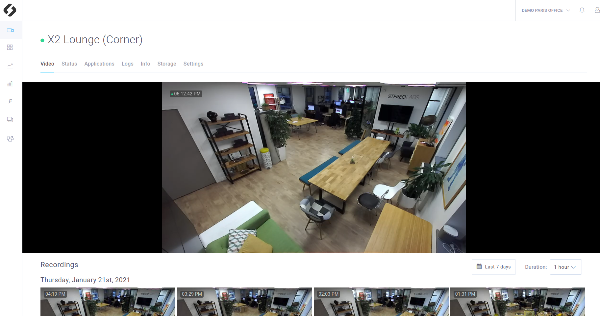
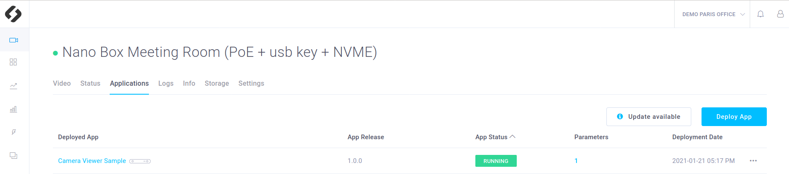
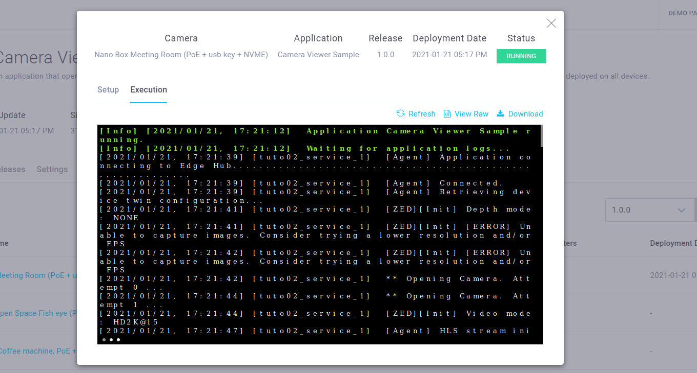

# Camera Viewer

This sample is a basic example that displays a ZED live view in the **ZED Hub Video Panel**. It also allows you to continuously record the video. This sample showcases the following ZED Hub features:

- **Logs** that inform you about the app's status
- **Live Stream** which displays the live video from your ZED camera in the **Video Panel**
- **Recordings** which are listed hour by hour in the **Video Panel**




## Getting started

- Add and set up your device on [ZED Hub](https://hub.stereolabs.com).
- For more information, read the [requirements](../../README.md#requirements).

## Build and deploy this tutorial

### How to build your application (for development)

Build your app :
```bash
$ cd sources
$ mkdir build
$ cd build
$ cmake ..
$ make -j$(nproc)
```

This application defines application parameters to modify its behavior while it is running. Move the `parameters.json` file to the path you specified in the `HubClient::loadApplicationParameters` function.
```bash
$ cp ../parameters.json .
```

Then to run your app :
```bash
$ ./Camera_Viewer_Sample
```

To dynamically change the parameters and activate their callbacks, edit the `parameters.json` file.

### How to deploy your application

Packages your app by generating an app.zip file using :

```bash
$ edge_cli deploy .
```

You can now [deploy your app](https://www.stereolabs.com/docs/cloud/applications/deployment/) using the ZED Hub interface:

- In your workspace, in the **Applications** section, click on **Add application**
- Select the ZIP file containing the application in your filesystem
- Select the devices on which you want to deploy the app and press **Upload**

## What you should see after deployment
Make sure that the recordings are enabled and that the privacy mode is disabled (**Settings panel** of your device, in the ZED Hub interface).
Thanks to this app you will have access to:
- a **Live Stream** that shows you the live video
- **Recordings** listed in the **Video panel**
- **Logs** that inform you about the app's status


### Live video
In the **Settings panel** of your device, make sure that the **Privacy mode** is disabled, otherwise, the video won't be visible.
Wait at least until your app is **running**.



In the **Devices** panel, select the device which is running your app. You should see the live video displayed in real-time.


### Recordings

In the **Settings** panel of your device, make sure that the **Enable Recording** parameter is set to `True`, otherwise, the video won't be recorded. Keep **Recording Mode** on **Continuous**, which will make the camera record as long as the application is running. The only limit is your device's Hard Drive storage. When there is no space left on it, the older recordings are **erased**. See [tutorial_06_video_event](../../tutorials/tutorial_06_video_event/README.md) to understand the **On Event** recording mode.

That's it, recording is active! The recordings are listed by hour and day in the **Video panel** of your device.

### App logs

Once the application is running, go to the **Logs** section on your device. You should be able to see logs associated with this application.

### Terminal logs
If you click on the app status, you will have access to the app **logs in a terminal**, both for the building and the running stage.




## Code overview


### Parameters callback
Some callbacks are defined and will be called when a parameter will be modified through the interface. They are used to modify a parameter value and notify that the change has been done.

> **Note**: There are two types of parameters : the **device parameters** and the **app parameters**.
> The device parameters can be modified in the settings panel of the device. However to be notified of the modification, the **Camera Viewer app** must define a callback associated with the parameter.

The app parameters can be modified in the parameters pop-up window. They also need to be associated with a callback and must be declared as explained in the [**tutorial_03_telemetries**](../../tutorials/tutorial_03_telemetries/README.md).

```c++
void onLocalStreamUpdate(FunctionEvent &event)
{
    event.status = 0;
    bool local_stream = HubClient::getParameter<bool>("local_stream", PARAMETER_TYPE::APPLICATION, false);

    if (local_stream)
    {

        sl::StreamingParameters stream_param;
        stream_param.codec = sl::STREAMING_CODEC::H264;

        // restart streaming with new parameters
        p_zed->disableStreaming();
        auto zed_error = p_zed->enableStreaming(stream_param);
        if (zed_error != sl::ERROR_CODE::SUCCESS)
        {
            std::cout << "[onAppStreamParamUpdate] " << sl::toVerbose(zed_error) << "\nExit program." << std::endl;
            p_zed->close();
            exit(EXIT_FAILURE);
        }
    }
    else
    {
        p_zed->disableStreaming();
    }
}
```


### Initialization and 'restart' loop

This sample app connects to the cloud and streams the live video feed to ZED Hub. Thanks to Edge Agent's restart policy, if the application fails, it will be restarted automatically.

Here is a detailed overview of the sample:

- Initialize communications with the cloud.

```cpp
    // Create ZED Object
    p_zed.reset(new sl::Camera());

    STATUS_CODE status_hub;
    status_hub = HubClient::connect("camera_viewer");
    if (status_hub != STATUS_CODE::SUCCESS)
    {
        std::cout << "Initialization error " << status_hub << std::endl;
        exit(EXIT_FAILURE);
    }
```

- Open the ZED with `p_zed->open(initParameters)` before the main loop ([ZED Documentation](https://www.stereolabs.com/docs/video/camera-controls/#camera-configuration)).

```cpp
    // Open the ZED camera
    sl::ERROR_CODE err_zed = p_zed->open(initParameters);
    if (err_zed != sl::ERROR_CODE::SUCCESS)
    {
        HubClient::sendLog("Camera initialization error : " +
                               std::string(toString(err_zed)),
                           LOG_LEVEL::ERROR);
        exit(EXIT_FAILURE);
    }

    // Register the camera once it's open
    UpdateParameters updateParameters;
    status_hub = HubClient::registerCamera(p_zed, updateParameters);
    if (status_hub != STATUS_CODE::SUCCESS) {
        std::cout << "Camera registration error " << status_hub << std::endl;
        exit(EXIT_FAILURE);
    }
```

- Setup the parameters callback before the main loop

```c++
        ...
    // Setup callback for parameters
    CallbackParameters callback_param;
    callback_param.setParameterCallback("onParamChange",
                                        "camera_resolution|camera_fps|camera_image_flip",
                                        CALLBACK_TYPE::ON_PARAMETER_UPDATE,
                                        PARAMETER_TYPE::DEVICE);
    HubClient::registerFunction(onInitParamUpdate, callback_param);
        ...
```

### Main loop

- In the main loop, grab a new frame and call `HubClient::update()`. Note that the `update` is responsible for both **live streaming** and **recording**. Every call to `HubClient::update()` streams a frame to ZED Hub, which is the same frame computed by the `grab()` method.

```c++
    HubClient::update(p_zed);
```
