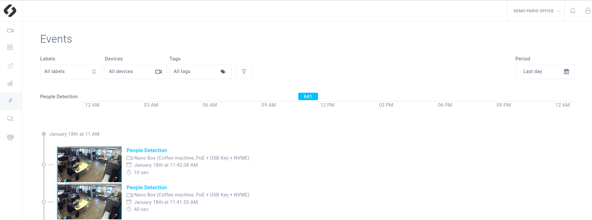
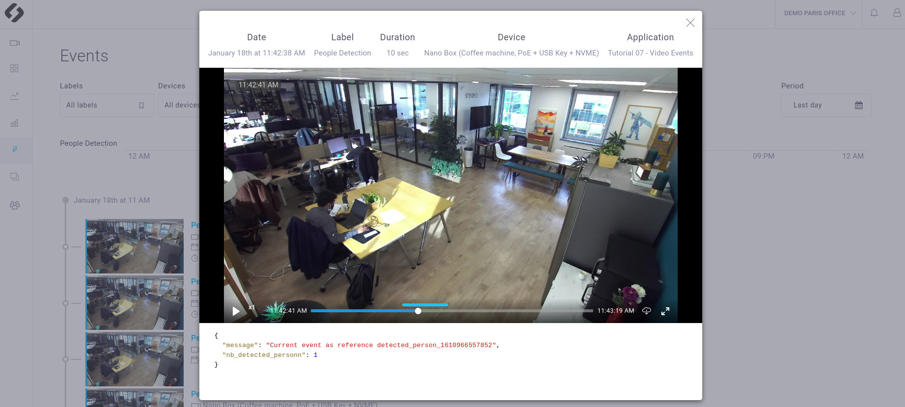

# Tutorial 6 - Video Event

A **Video Event** is a **video recording** associated with a **description** stored in one or several JSON.
This application shows how to define a **Video Event** in a ZED Hub app. This event will be available in the **Video Event** ZED Hub interface.
In this tutorial, a video is considered an event if **at least one person is detected** in the image. To detect people the **Object Detection** module of the SDK will be used. 




## Getting started

- Add and set up your device on [ZED Hub](https://hub.stereolabs.com).
- For more information, read the [requirements](../../README.md#requirements).

## Build and run this tutorial for development

With Edge Agent installed and running, you can build this tutorial with the following commands:
```bash
$ mkdir build
$ cd build
$ cmake ..
$ make -j$(nproc)
```

Then run your app:
```bash
$ ./ZED_Hub_Tutorial_6
```

## What you should see after deployment
Make sure that the recordings are enabled and that the privacy mode is disabled (Settings panel of your device, in the ZED Hub interface).
As each time a ZED is opened, you will find the **live stream** and the **recordings** in the **Video Panel** of your device as soon as your app is **running**.

A video is considered an event if **at least one person is detected** in the image. Therefore if your app is running and someone is seen by your ZED, you should see an **Event** in the **Video Event panel** corresponding to this situation.


You can click on it. You have access to the video and the stored data of the event. You have access to a longer video than the exact event duration (you can watch a few seconds before and after the event). The blue line indicates which part of the video is associated with the event.




## Code overview - C++

### Initialization
The application connects to ZED Hub with `HubClient::connect` and registers the opened ZED camera with `HubClient::registerCamera`.
**Object detection** is enabled with `enableObjectDetection`. Note that positional tracking is required to use it (`enablePositionalTracking` must be called).

```c++
    sl::ObjectDetectionParameters obj_det_params;
    obj_det_params.image_sync = true;
    obj_det_params.enable_tracking = false;
    obj_det_params.detection_model = sl::OBJECT_DETECTION_MODEL::MULTI_CLASS_BOX_FAST;
    zed_error = p_zed->enableObjectDetection(obj_det_params);
```

The detection is limited to PERSON (meaning for instance that the Vehicles are ignored), and the detection threshold is set to 50:

```c++
    ObjectDetectionRuntimeParameters objectTracker_parameters_rt;
    objectTracker_parameters_rt.detection_confidence_threshold = 50;
    objectTracker_parameters_rt.object_class_filter.clear();
    objectTracker_parameters_rt.object_class_filter.push_back(sl::OBJECT_CLASS::PERSON);
```


### Main loop

Each time a frame is successfully **grabbed**, the detected objects are retrieved with the `retrieveObjects` function and stored in `objects`.

Remember that the frame is part of an event as soon as **at least one person is detected**. However, a **second rule** is necessary to **distinguish one event from another**. Once again, this rule depends on how you define it. In this tutorial, we decided to define a new event as soon as **no one has been seen for 10 frames**. 

A frame is defined as part of a Video Event if the `HubClient::startVideoEvent` is called with the **corresponding timestamp**.
> **Note**: You should not define a new Video event each time you call `HubClient::addVideoEvent` but you should extend the current one by calling `HubClient::updateVideoEvent` by using the same `event.reference`.

```c++
    EventParameters event_params;
    event_params.timestamp = current_ts.getMilliseconds();
    event_params.reference = event_reference;
    std::string event_label = "People Detection"; // or label of your choice
    json event2send;                              // Use to store all the data associated to the video event.
    event2send["message"] = "Current event as reference " + event_reference;
    event2send["nb_detected_person"] = objects.object_list.size();

    if (new_event || !first_event_sent)
    {
        HubClient::startVideoEvent(p_zed, event_label, event2send, event_params);
        first_event_sent = true;
        std::cout << "Event started" << std::endl;
    }
    else
    {
        HubClient::updateVideoEvent(p_zed, event_label, event2send, event_params);
        std::cout << "Event updated" << std::endl;
    }
```